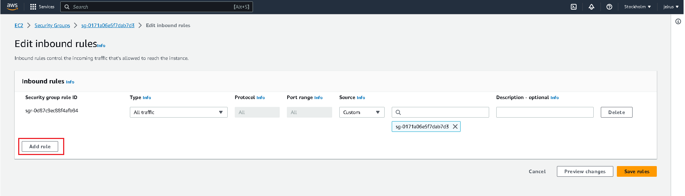
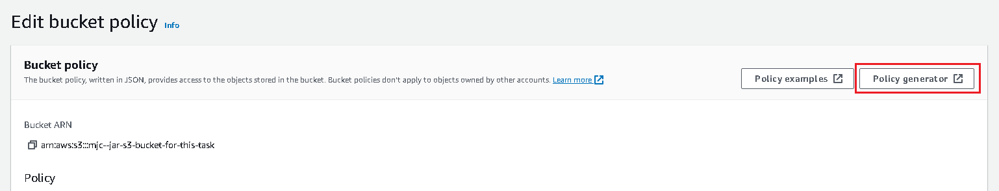
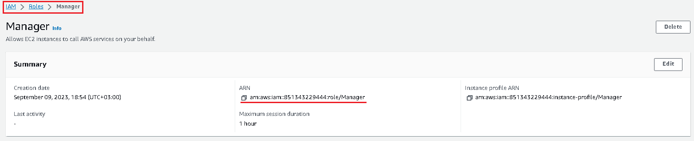
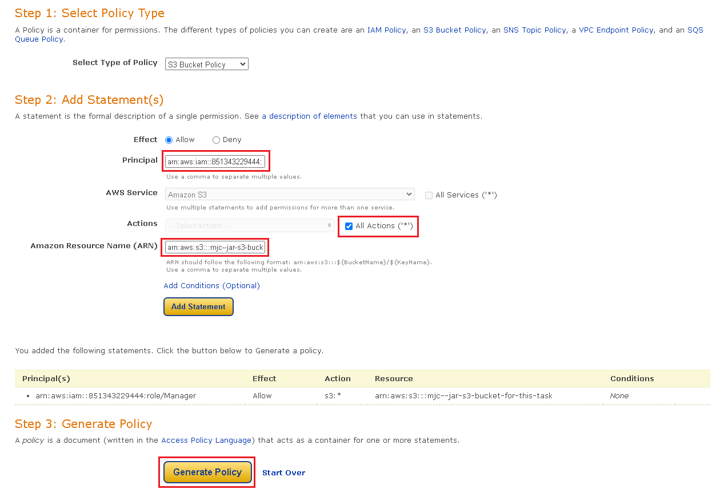
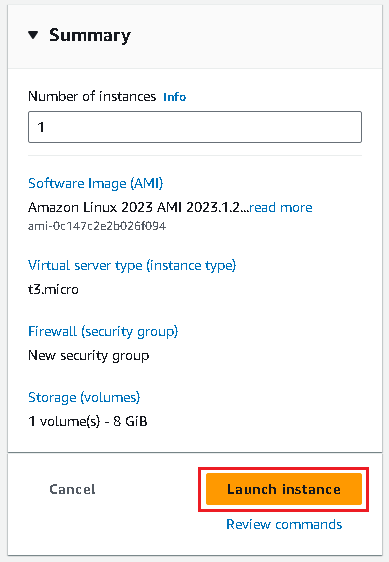
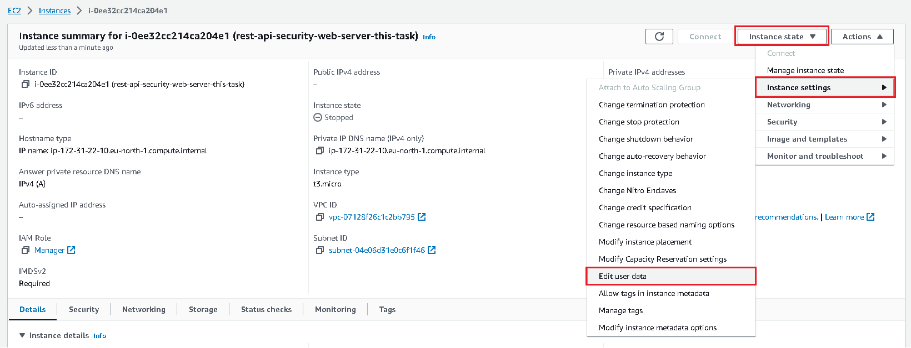
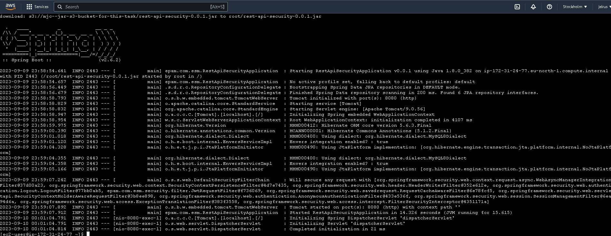
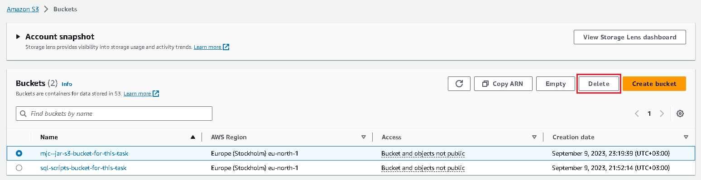

# AWS

## Task

**Step 1. AWS Account Creation**

Visit https://aws.amazon.com/free

Click on "Create new account", if you don't have one


Enter email and username for account


Apply verification code from email


Fill password boxes


Fill other information about account


Fill credit card info


Sign up for AWS


Enter verification code from SMS


Choose plan and complete registration


Proceed to AWS Management Console


Login to access AWS


**Step 2. Application Role Creation**

Go to IAM section and navigate to Roles section


Create new role


Select Trusted entity


Add permissions


Enter role name and check data from previous steps


*Optional: check if role was created and profile applied*

Open aws cloud shell console in the bottom-left corner


Enter console command to show list of roles:

>aws iam list-roles


As we can see role has been applied. Now, check if instance profile for the role has been created.

Enter console command to show list of profile instances:

>aws iam list-instance-profiles


Everything is fine, instance has been created.

Alternatively instance profile can be created with these two commands in aws cloud shell:

>aws iam create-instance-profile --instance-profile-name %instance_profile_name%
>aws iam add-role-to-instance-profile --role-name %role_name% --instance-profile-name %instance_profile_name%

**Step 3. Launch RDS instance**

**_NOTE: Considering that we need the link to our database and currently can't configure it dynamically, I decided to 
create RDS instance first, override database url in properties yml file and package it with new properties for the next
step._**

**_So Step 3 and 4 was swapped_**

Open RDS dashboard


Click on Create database in Create database section


Configure setting for new database

In Choose database creation method choose Standard create option
In Engine options choose MySql and Engine version compatible with database, in this case 8.0.33
In Templates choose Free Tier option
In Setting set name for database and password, in this case properties are same as in properties.yml file
In Connectivity choose Yes for Public Access option
Click Create Database at the end of page


**_NOTE: Creating instance takes time, so be sure that status changed from 'Creating' to 'Available'_**

Created database instance


Configure security groups for RDS

Open EC2 dashboard


On the left side find menu 'Network & Security' select option 'Security Groups'


Edit inbound rules


Add new rule



Choose in Type box MySQL/Aurora type, in Source Info box AnywhereIPv4, in next box 0.0.0.0/0. Save rules


As we can see security group rule has been applied


Check if instance can be reached

Open RDS dashboard


In Resources section open DB Instances


Click on database instance


Copy link from 'Connectivity & security' -> 'Endpoint & port'


Add database within IntellijIdea via database manager


Provide database information for created db and save


Connect


As we can see database was successfully reached. Write test script to ensure connection is successful


Script ran successfully. Remove all created modifications. 

Configure Database

Option 1. Load scripts manually via IDE

Open IDE, execute .sql scripts


Option 2. Load scripts automatically via Spring Configs

Open IDE, open application.yml or application.properties file, edit url, username, password according to RDS configs


**_NOTE: Populating and configuring tables with this option is not recommended, because Spring will run data.sql and 
schema.sql always at startup and will overwrite any data if tables was changed_**

Option 3. Load scripts from the S3 Bucket

Open S3 Bucket dashboard


Click 'Create bucket'


Type name and click 'Create bucket' at the bottom of the page


Click on just created bucket


Click 'Upload'


Drag and drop files or use explorer for adding files, click upload


Files loaded successfully


Now open CloudShell and execute command for sql scripts located in previously created bucket

>aws s3  cp  %path-to-file-in-bucket% - | mysql -h %database-host% -P %database-port% -u %user-name% -p %password% %database-name%

Lets run schema.sql


Tables were created successfully


Now populate these tables with data.sql, populating time depends on the file size


Check if any changes applied, as we can see all data was populated 


**_NOTE: I am checking by the last line of the data.sql file_**


RDS section complete

**Step 4. Upload Application Jar to AWS S3**

Before uploading .jar configure application.yml or application.properties in your project according to 
RDS instance config (url, username, password)


Package project to .jar file

**_NOTE: I am doing this with Maven, so I packaged my project with commands clean & package_**


Navigate to S3 Buckets dashboard


Click 'Create bucket'


Type name and click 'Create bucket' at the bottom of the page


Click on just created bucket


Click 'Upload'


Drag and drop files or use explorer for adding files, click upload


Files loaded successfully


Edit bucket policies

Navigate to S3 Buckets dashboard


Click on bucket


Go to Permissions -> Bucket Policy -> Edit


Click on 'Policy generator'



Copy role arn from IAM -> Roles -> Click on role -> Copy ARN



Copy bucket arn from S3 -> Buckets -> Click on bucket -> Properties -> Copy ARN


Insert into Policy Generator fields Principal - Role ARN, Amazon Resource Name - Bucket ARN, click 'Generate Policy'



Copy JSON from pop up window and go back to Bucket Policy


Click save changes


S3 section complete

**Step 5. Launch EC2 instance**

Navigate to EC2 dashboard


Click on 'Launch Instance'


Type web server name in Name and Tags section
Select Amazon Linux 2 in Application and OS Images section
Select instance type t3.micro in Instance type section
Click Create new key pair in Key Pair (login) section


In popped window type key pair name and select .ppk extension, click 'Create key pair'


In Network settings choose default security group


And finally click 'Launch instance' in Summary section on the right



If everything alright, EC2 instance will pop shortly in dashboard list


Apply our custom role to EC2 Instance


Choose custom role from list and Update IAM role


Now configure our policies, navigate in the menu on the left to Network & Security section and click on 
Security Groups, then on Edit inbound rules


Add TCP on 8080 port and SSH on 22 port and Save rules


Connect to EC2 instance

Download and install [Putty](https://putty.org.ru/download.html)

Before opening Putty, copy Public IPv4 EC2 Instance from Instance Page


Open Putty, in the menu Connection -> SSh -> Auth -> Credentials apply .ppk key


Go to the Session section in the menu and paste Public IPv4 into Host name text box and click Open


Click Accept and proceed


Login as ec2-user


Close Putty

Now go to EC2 Instance Dashboard and stop EC2 Instance 


Now go to EC2 Instance Page and select in Actions menu -> Instance settings -> Edit user data



Write script for downloading java, copying project .jar from S3 bucket and running application

```
Content-Type: multipart/mixed; boundary="//"
MIME-Version: 1.0

--//
Content-Type: text/cloud-config; charset="us-ascii"
MIME-Version: 1.0
Content-Transfer-Encoding: 7bit
Content-Disposition: attachment; filename="cloud-config.txt"

#cloud-config
cloud_final_modules:
- [scripts-user, always]

--//
Content-Type: text/x-shellscript; charset="us-ascii"
MIME-Version: 1.0
Content-Transfer-Encoding: 7bit
Content-Disposition: attachment; filename="userdata.txt"

#!/bin/bash
sudo yum update -y
sudo yum install -y java-1.8.0-openjdk-devel -y
aws s3 cp s3://mjc--jar-s3-bucket-for-this-task/rest-api-security-0.0.1.jar ~/
java -jar ~/rest-api-security-0.0.1.jar
--//
```

Click Save


Restart EC2 instance


Check if Instance state is 'Running' and click 'Connect'


Copy public IP address and connect to instance


In opened window run to see if any scripts run

First, lets check java version with

```
java -version
```
Java was installed on instance.


Second, lets check if project .jar was downloaded and Spring Application has started by checking logs with

```
sudo cat /var/log/cloud-init-output.log
```



Project's .jar was downloaded and Spring Application has started

And finally lets check if we can reach our instance with previously copied public ip in Postman


**Step 6. Terminate or remove all created resources/services**

Terminate EC2 instance(s)


Delete S3 Buckets



Delete RDS instance(s)


