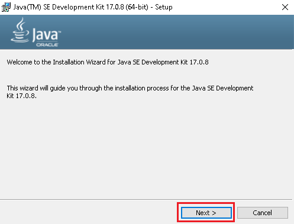
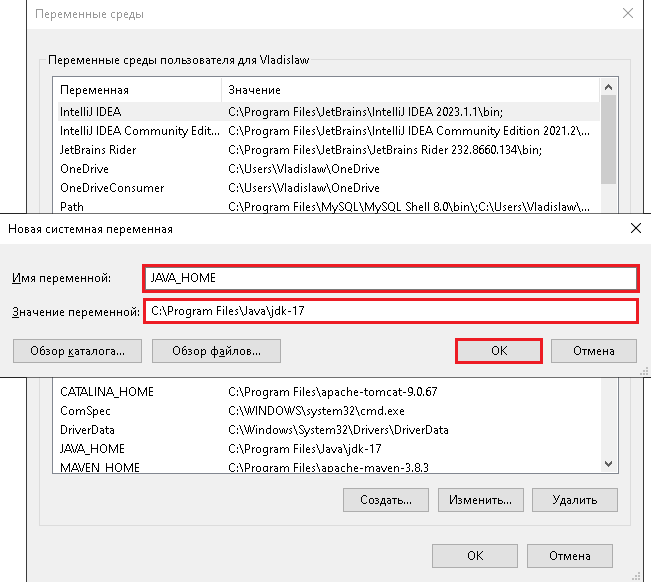
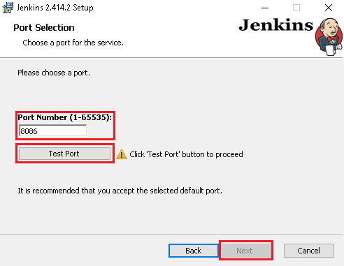
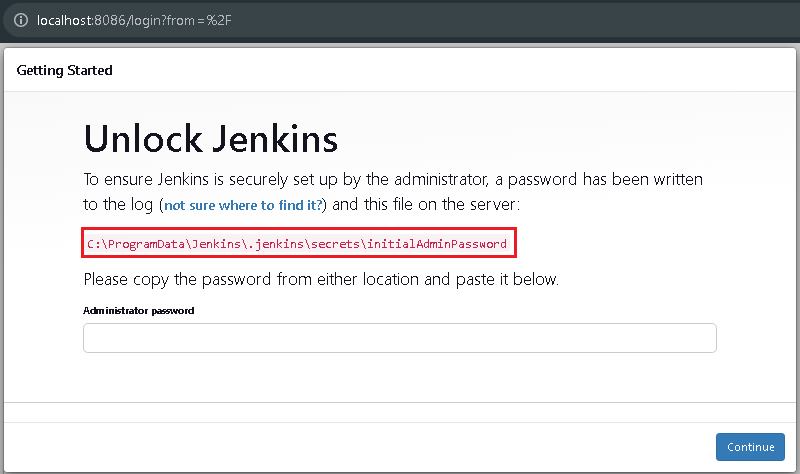
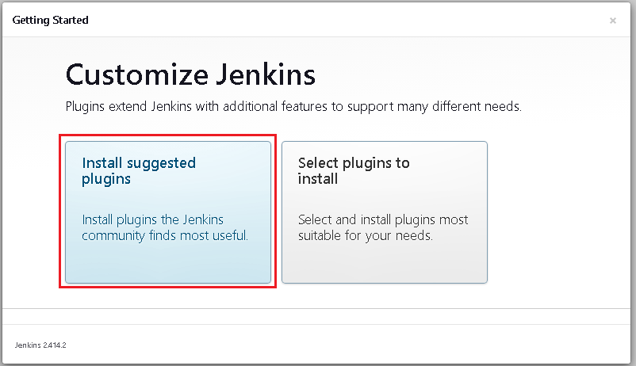
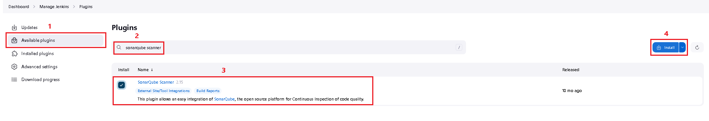
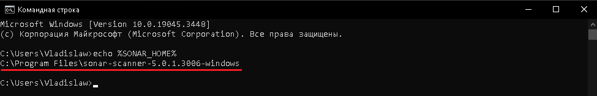
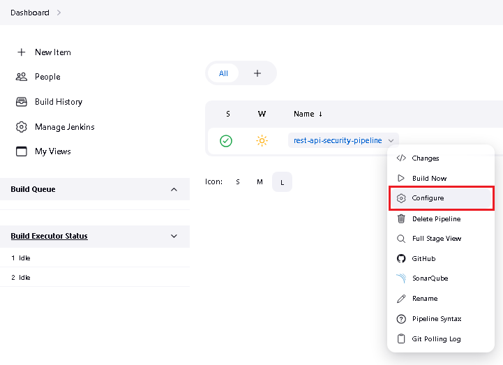
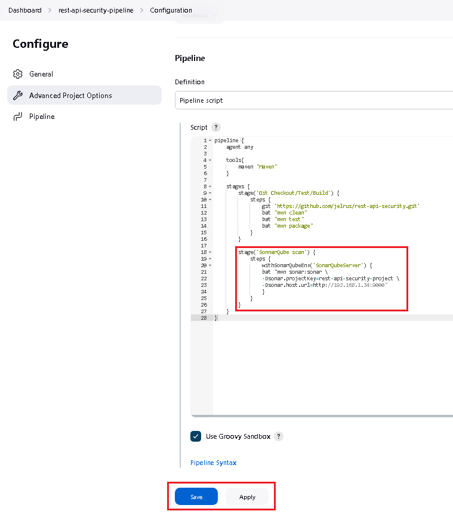

# CI-CD

## Task

1. Configure Jenkins security (install Role strategy plugin). 
   Remove anonymous access. Create administrator user (all permissions) and developer user (build job, cancel builds). 
   Add Jenkins credentials to Readme file in your git repository.
2. Configure Jenkins build job (poll, run test, build) to check out your repository, use polling interval.
3. Install SonarQube. Configure Jenkins to use local SonarQube installation. 
   Analyze your source code with SonarQube after Maven builds your project. Use JaCoCo for code coverage.
4. Jenkins should deploy your application (after passing SonarQube quality gate) under your local tomcat server. 
   Please use Jenkins Tomcat Deploy plugin.

For the work we will need following tools and plugins

**Tools:**
1. Java 17 - runtime environment and compiler
2. Apache Maven 3.8.3 - packaging and deploying
3. Jenkins 2.414.2 LTS - ci-cd system
4. Git - version control system
5. SonarQube 10.2 - code quality and security inspection
6. Apache Tomcat 9.0 - container for application

**Maven Plugins**
1. Sonar Plugin - SonarQube integration
2. Jacoco Plugin - JaCoCo integration
3. Tomcat 7 Plugin - Tomcat integration

**Jenkins Plugins**
1. Locale - change language of Jenkins
2. Role-base Authorization Strategy - adds options related with roles
3. Maven Integration - adds maven options in Jenkins
4. SonarQube Scanner - integration with SonarQube server
5. Sonar Quality Gates - checks if predefined sonar quality gates meets quality conditions
6. JaCoCo - code coverage
7. Deploy to container - deploying application to container (Tomcat)

## Solution

### Step 1. Install Java

**NOTE: This section can be skipped if Java 17 was installed previously**

Download [Java 17](https://www.oracle.com/java/technologies/javase/jdk17-archive-downloads.html)

Find downloaded file and execute. Press next to continue installation

Check if Java will be installed to proper folder. Change destination if not. Press next to proceed

After installation quit installation wizard

On Start panel type into Search 'Environment variables' -> Open Change environment variables

In opened window press on Environment variables

Click create

**a. First Java installation**

In popped up window type env variable name (JAVA_HOME) and path to installed Java 17 JDK (C:\Program Files\jdk17)
Click OK

Find Path env variable and click Edit

Click Create. Type %JAVA_HOME%\bin. Press OK

**b. Another Java installation**

Find JAVA_HOME env variable and click Edit

Change JAVA_HOME env value to Java 17 JDK path and press OK

Close every opened window by pressing OK or Apply. Reboot PC

On Start panel type into Search 'cmd' -> Command Line -> Run as Administrator

Type following commands (checks if java, java compiler and java env were applied properly)

> java -version
> 
> javac -version
> 
> echo %JAVA_HOME%

If everything set properly these commands will show version of java, java compiler and java path

### Step 2. Install Apache Maven 3.8.3

**NOTE: This section can be skipped if Apache Maven 3.8+ was installed previously**

Download [Apache Maven](https://repo.maven.apache.org/maven2/org/apache/maven/apache-maven/3.8.3/)

Extract content of archive into folder

On Start panel type into Search 'Environment variables' -> Open Change environment variables

In opened window press on Environment variables

Click create

In popped up window type env variable name (MAVEN_HOME) and path to unpacked Apache Maven 
(C:\Program Files\apache-maven-3.8.3). Click OK

Find Path env variable and click Edit

Click Create. Type %MAVEN_HOME%\bin. Press OK

Close every opened window by pressing OK or Apply. Reboot PC

On Start panel type into Search 'cmd' -> Command Line -> Run as Administrator

Type following commands (checks if maven and maven env were applied properly)

> mvn -version
>
> echo %MAVEN_HOME%

If everything set properly these commands will show version of maven and maven path

### Step 3. Install Jenkins

**NOTE: This section can be skipped if Jenkins was installed previously**

Download [Jenkins](https://www.jenkins.io/download/)

Execute downloaded file and press Next

Specify installation path and press Next

Check Run service as LocalSystem in Logon Type and press Next

Select Port Number. Test if port available. If yes - press Next, if no - change port

**NOTE: Jenkins runs on port 8080 by default same as Tomcat Server, ensure that Jenkins and Tomcat will run on 
separate ports**

Select path of JDK or JRE and press Next

Select options for Jenkins Service

Press Install

Press Finish

### Step 4. Configure Jenkins

Open browser and proceed to http://localhost:8086/ for further configurations

Copy path to password location, open explorer and copy it into address line, open file with text editor, 
copy Administrator password

Paste it in Jenkins and press Continue

Install suggested plugin

Wait until all plugins will be installed

Fill data for admin user. Save and Continue

Configure instance

Start using Jenkins

### Step 5. Change language (optional)

If your locale is not set to English by default, you can manage this by Locale plugin

To install plugin go to Manage Jenkins -> Plugins

On Plugins page go to Available Plugins -> Type in search 'Locale' -> select Locale plugin -> Click Install

When all updates and installations succeeds reboot Jenkins by selecting Reboot Jenkins after installation

After rebooting (re-log if needed) go to Manage Jenkins -> System

Find Locale section, type in text box 'ENGLISH' and check 'Ignore browser preference and force this language to all users'.
Apply and save

Go back to dashboard

### Step 6. Configure Jenkins security

Install Role-based Strategy plugin

To install plugin go to Manage Jenkins -> Plugins

On Plugins page go to Available Plugins -> Type in search 'Role-based Authorization Strategy' 
-> select Role-based Authorization Strategy plugin -> Click Install

When all updates and installations succeeds reboot Jenkins by selecting Reboot Jenkins after installation

After rebooting (re-log if needed) go to Manage Jenkins -> Security.

In Authentication section choose from dropdown Role-Based Strategy option. Apply and Save

Now new option will appear in Mange Jenkins -> Security section

Proceed to Manage and Assign Roles

As we can see admin role is already created with all permissions

Create developer role and add it. Check only Job Build and Job Cancel options for it. Apply and Save

Create users

Go to Manage Jenkins -> Users

Create developer user

Fill out form and click Create user

Now developer user created

Assign roles

Go to Manage Jenkins -> Manage and Assign Roles

Select Assign Roles tab on the left side. Click Add User in Global Roles section. In popped message type developer name 
from created developer user before. Apply and Save

Add credentials to git repository

Push to repository

### Step 7. Build job for project polling with polling interval, testing and building

Install Git service (if not installed already)

Download [Git SCM](https://git-scm.com/download/win) 

Start downloaded executable

Press Next on every installation steps (installation with default options) and press Finish at the end

Check in cmd that git installed

>git version

Now proceed into Manage Jenkins -> Tools

In section JDK installations, click Add JDK, set name (e.g. Java 17) and path to JDK in JAVA_HOME

In section Maven installations, remove check from Install automatically option, set name (e.g. Maven) 
and path to Maven in MAVEN_HOME

Apply and Save

Install Maven Integration plugin

Go to Manage Jenkins -> Plugins

On Plugins page go to Available Plugins -> Type in search 'Maven Integration' -> select Role-based Maven Integration 
plugin -> Click Install

When all updates and installations succeeds reboot Jenkins by selecting Reboot Jenkins after installation

Go to the Dashboard and click Create a job

Set name for a job, choose job type and click OK down below

**NOTE: I will use Pipeline type in this task**

Go to GIT, copy link to your project's git repo (https://github.com/jelrus/rest-api-security.git)

Go back to Jenkins Pipeline Configuration.

In General section:

Fill description (optional)

Check GitHub project box and paste git project's link

In Build Triggers section:

Check Poll SCM box

Set Schedule for every 5 minutes

> H/5 * * * *

Means SCM will check for changes every 5 minutes, if repo was affected by changes it pipeline will do every step 
describes in the Pipeline section

In Pipeline section:

Write script

      pipeline {
         agent any

         tools{
            maven "Maven"
         }
      
         stages {
            stage('GIT Checkout/Test/Build Artifact') {
               steps {
                git 'https://github.com/jelrus/rest-api-security.git'
                bat "mvn clean"
                bat "mvn test"
                bat "mvn package -Dmaven.test.skip=true"
               }
            }
         }
      }

Apply and Save

**Script do the following:**
1. Checks out GIT repo
2. Cleans project
3. Runs tests in project
4. Packs project into java runnable (.jar, .war, .ear, - packaging can be configured from pom.xml)

Now we can manually build project

Click on project

As we can see build was successful

Lets checkout if SCM Polling works

Edit README.md, commit and push

As we can see GIT SCM Polling works and build was successful

### Step 8. Install SonarQube

Download [Docker](https://www.docker.com/products/docker-desktop/)

Start downloaded executable

**NOTE: Before installing Docker ensure that virtual machine option in BIOS/UEFI is enabled 
(location depends on distribution) and WSL Kernel is installed/updated (from Microsoft Store)**

Wait for installation and click Close

Now run Docker, in search section write 'sonarqube' and find the first image, pull it

Click on Images (on the right side) and checkout if SonarQube image was installed

Open cmd and type command for starting SonarQube server from image

>docker run -d --name sonarqube -e SONAR_ES_BOOTSTRAP_CHECKS_DISABLE=true -p 9000:9000 sonarqube:latest

Go back to Docker, open Containers tab (on the right) and see that the SonarQube server has been started

In browser go to http://localhost:9000/

**NOTE: By default SonarQube login and password are admin/admin**

Fill admin default credentials, click Log in button and proceed

Create new password for admin user and go to the next page

That's all, we configured SonarQube Server

**Integration with Jenkins**

Go to Dashboard -> Manage Jenkins -> Plugins

Click Available Plugins tab on the left -> Enter into search bar 'sonarqube' -> 
Find and select SonarQube Scanner plugin -> Install

After installation fo back to Available Plugins tab on the left -> Enter into search bar 'sonar quality gates' ->
Find and select Sonar Quality Gates plugin -> Install

Restart Jenkins after plugins has been applied

**Integration with Maven Project**

Open up project, find pom.xml, add packaging .war type under description tag

Add Sonar Maven plugin into plugins section

Commit changes

**Create SonarQube project**

Access SonarQube Server by http://localhost:9000/ and find Create project manually option

Fill out form and click Next

Choose Use the global settings option, create project

Choose Locally option

Generate SonarQube access token

Copy created token somewhere, click Continue

Choose options for generating sonar run script

Mention, that SonarQube asks for local installation to run this script, copy script somewhere

**SonarQube local installation**

Download [SonarQube](https://docs.sonarsource.com/sonarqube/10.2/analyzing-source-code/scanners/sonarscanner/)

Choose folder and extract downloaded SonarQube archive

Now proceed to the extraction destination, open up conf folder, find and open 

Open sonar-scanner.properties file with text editor

Add the following lines into .properties file, by these lines we provide project's key, name, version and 
binaries location for scanning, save file

**NOTE: If file needs special permissions for editing:**

1. Copy original file somewhere
2. Delete original file from sonarqube/conf folder 
3. Edit copied file 
4. Insert it into sonarqube/conf folder

Now add SonarQube as environment variable

Enter into search bar Edit environment variables, open it

Click on Environment variables

Create -> Enter environment variable name and path to previously extracted SonarQube

Find Path variable -> Edit... -> Create -> Type %SONAR_HOME%\bin -> Click OK

Reboot

Check if SonarQube env was set correctly

Open cmd and run command

>echo %SONAR_HOME%

As we can see env was set correctly

**SonarQube Scanner Configuration for Jenkins**

Reach Jenkins by http://localhost:8086/ -> Manage Jenkins -> Tools

Find SonarQube Scanner Installations section -> Set name -> Specify path of previously locally installed SonarQube 
-> Apply and Save

**SonarQube Server Configuration for Jenkins**

Go to Dashboard -> Manage Jenkins -> System

Find SonarQube Servers section -> Set name, Server URL -> Click Add under Server authentication token section

In popped up window in Kind section select Secret text option

In Secret text box type your previously saved token

In ID text box type your project name. Add

Apply and Save

**SonarQube Quality Gates Configuration for Jenkins**

Navigate to Manage Jenkins -> System (if not in the System section already)

Navigate to Quality Gates - SonarQube section -> Fill out form with default values and apply your previously generated 
token -> Add Sonar Instance

Apply and Save

**Pipeline configuration for SonarQube**

Proceed to Jenkins Dashboard -> Select Configure option from pipeline menu

Navigate to Pipeline section, add sonar part into pipeline script

      stage('SonnarQube scan') {
         steps {
            withSonarQubeEnv('SonarQubeServer') {
            bat "mvn sonar:sonar \
            -Dsonar.projectKey=rest-api-security-project \
            -Dsonar.host.url=http://192.168.1.34:9000"
            }
         }
      }

In this case name must be the same as we configured in Manage Jenkins -> System -> Quality Gates - SonarQube

Project Key must be the same as we created in SonarQube

Apply and Save

**NOTE: To see open IP of your local machine you can use this command in cmd**

>ipconfig

Build pipeline

As we can see pipeline job ran successfully

Check SonarQube server by http://localhost:9000/

No JaCoCo has been applied to project yet, so no coverage has been computed

**JaCoCo Configuration for Jenkins**

Go to Jenkins by http://localhost:8086/

Go to Manage Jenkins -> Plugins

Click Available Plugins tab on the left -> Enter into search bar 'jacoco' ->
Find and select JaCoCo plugin -> Install

Restart Jenkins after plugin has been installed

**JaCoCo Configuration for Maven Project**

Go to project find pom.xml and add JaCoCo plugin

Commit and push changes

**Configure Pipeline for JaCoCo**

Go to Dashboard -> Select job -> Configure

Navigate to Pipeline section and add another part of the script

      stage('JaCoCo coverage') {
            steps {
                jacoco( 
                    execPattern: 'target/*.exec',
                    classPattern: 'target/classes',
                    sourcePattern: 'src/main/java',
                    exclusionPattern: 'src/test*'
                    )
            }
      }

Apply and Save

Execute pipeline

As we can see pipeline was executed successfully

Check SonarQube server by http://localhost:9000/

As JaCoCo has been applied to project, coverage has been computed

### Step 9. Deploy application to Tomcat

**Tomcat Installation and Configuration**

Download [Tomcat](https://tomcat.apache.org/download-90.cgi)

Extract downloaded archive

Type Edit environment variables in Start search bar -> Open Edit environment variables

Click Environment variables...

Click Create -> Set variable name - CATALINA_HOME and Value of variable - path to extracted Tomcat -> Click OK

Select Path variable -> Click Edit -> Click Add -> Add %CATALINA_HOME%\bin parameter -> Click OK

Go to Apache Tomcat folder -> find conf folder -> find and open with text-editor tomcat-users.xml

Add following lines just before enclosing of tomcat users tag

      <role rolename="manager-gui"/>
      <role rolename="manager-status"/>
      <role rolename="manager-script"/>
      <role rolename="manager-jmx"/>
      <user username="tomcat" password="password" roles="manager-gui, manager-status, manager-script, manager-jmx"/>

By this we are adding tomcat manager user with necessary policies, close and save file

Optional: Edit context path

Go to Apache Tomcat folder -> find conf folder -> find and open with text-editor context.xml

Edit following lines

      <Context>

With 

      <Context path="" docBase="rest-api-security">

Now our project will deploy into http://localhost:8080/ instead of http://localhost:8080/rest-api-security

**Run Tomcat Server**

Open up Apache Tomcat Folder -> find bin folder and open it -> find startup.bat and execute it

Console window will open - don't close it

**Configure Tomcat for Maven Project**

Open Maven project -> Find pom.xml -> Add Tomcat Spring Boot dependency

Next in pom.xml add final name in build

Next in pom.xml add Tomcat Maven plugin

**NOTE: username and password should be the same as we defined in tomcat-users.xml previously** 

**NOTE: path should be the same as in context.xml, if this option was skipped path should look like**

      <path>/<your-app-name></path>

Go to Main class of Spring Boot Application and extend it from SpringBootServletInitializer class

Commit changes to repo

**Configure Tomcat for Jenkins**

Open Jenkins server by http://localhost:9000/

Click Available Plugins tab on the left -> Enter into search bar 'deploy to container' ->
Find and select Deploy to container plugin -> Install

Restart Jenkins after plugin has been installed

**Configure Pipeline for Tomcat**

Go to Dashboard -> Select job -> Configure

Navigate to Pipeline section, add deployment part into pipeline script

      stage('Deployment') {
         steps{
            bat "mvn tomcat7:redeploy"
         }
      }

Apply and Save

Execute pipeline

As we can see build was successful

**NOTE: Previous build failed (#6) because Tomcat server wasn't running**

Proceed to http://localhost:8080/ in Postman or browser

