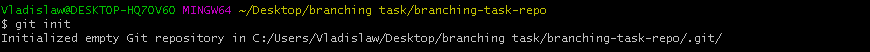
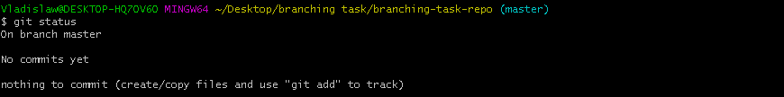
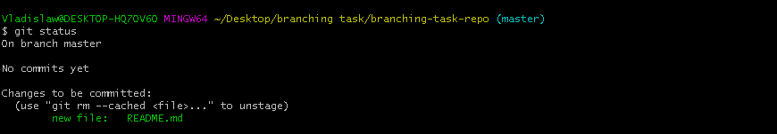

## Branching Task

----------------------------------------------------------------

### Contents

1. Task
2. Used commands
3. Solution

----------------------------------------------------------------

### 1. Task

Learn basic git commands by recreating steps from tutorial applied to task

----------------------------------------------------------------

### 2. Used commands

- Console commands

| Syntax             | Description                                                                    |
|--------------------|--------------------------------------------------------------------------------|
| `mkdir <dirname>`  | creates new directory in current directory with `<dirname>` if not exist       |
| `cd <path>`        | changes current working directory to directory with `<path>`                   |
| `ls -1`            | shows contents of the directory  flag `-1` shows contents in vertical list |
| `touch <filename>` | creates empty file with `<filename>`                                           |

- Git commands

| Syntax                                                                        | Description                                                                                                                         |
|-------------------------------------------------------------------------------|-------------------------------------------------------------------------------------------------------------------------------------|
| `git init`                                                                    | creates empty git repository in working directory                                                                                   |
| `git status`                                                                  | displays the tracked, untracked files and changes                                                                                   |
| `vim <filename>`                                                              | launches file in vim editor                                                                                                         |
| `git add <path>`                                                              | adds file contents to index                                                                                                         |
| `git commit -m "<msg>"`                                                       | records changes to repository  flag `-m <msg>` used to add given `<msg>`  as the commit message                             |
| `git checkout <branchname>` `git checkout -b <branchname>`                | switches to branch with `<branchname>` flag `-b <branchname` used to create new branch   in current branch and switch to it |
| `git show-branch`                                                             | shows branches and their commits                                                                                                    |
| `vi <filename>`                                                               | launches file in vi editor                                                                                                          |
| `git diff --cached`                                                           | shows changes between commits  flag `--cached` use to see changes between latest and staged commits                             |
| `git merge <branchname> --no-ff`                                              | joins two or more development histories together flag `--no-ff` used to merge commit in all cases                               |
| `gitk`                                                                        | launches graphical repository browser                                                                                               |
| `git log --all --graph -- decorate`  `--oneline --simplify-by-decoration` | shows commit log                                                                                                                    |
| `git log --graph --oneline --all`                                             | shows commit log                                                                                                                    |

----------------------------------------------------------------

### 3. Solution

1.  Create new directory `branching-task-repo` for repo with `mkdir branching-task-repo`

2. Change directory to created with `cd branching-task-repo/`

3. Create empty git repository with `git init`

4. Check untracked changes with `git status`

5. Check if repository empty with `ls -1`

6. Create empty *.md file README.md with `touch README.md`

7. Check untracked changes with `git status`   As we can see repo have untracked upper-mentioned `README.md` file

8. Open `README.md` in vim with `vim README.md`

9. In opened window press `i` to enter edit mode.   Add text e.g. `Hello World!` to the `README.md` on the first line.   Press `ESC` to leave edit mode. Press `SHIFT + ZZ` to save changes and close window.

10. Check untracked changes with `git status`  As we can see file `README.md` is still untracked.

11. Add current directory to staging state with `git add .`

12. Check tracked changes with `git status`  As we can see file `README.md` is ready to be committed (staged)

13. Commit `README.md` to `master` branch with message `created readme` with `git commit -m "created readme"`

14. Check if commit applied properly with `git status` As we can see `README.md` was committed and there's nothing to commit

15. Create new branch `develop` from `master` branch and switch to it with `git checkout -b develop`

16. Check if branch `develop` was created with `git show-branch`

17. Create new branch `git_task` from `develop` branch and switch to it with `git checkout -b git_task`

18. Check if branch `git_task` was created with `git show-branch`

19. Create new branch `git_0` from `git_task` branch and switch to it with `git checkout -b git_0`

20. Check if branch `git_0` was created with `git show-branch`

21. Open `README.md` in vi with `vi README.md`

22. In opened window press `i` to enter edit mode.   Edit text e.g. add new line to text.   Press `ESC` to leave edit mode. Press `SHIFT + ZZ` to save changes and close window.

23. Check untracked changes with `git status`. As we can see file `README.md` was modified.

24. Add current directory to staging state with `git add .`

25. Check tracked changes with `git status`. As we can see file `README.md` is ready to be committed (staged)

26. Look on the differences in `README.md` file with `git diff --cached`

27. Commit `README.md` file to `git_0` branch with message `added git_0 line to readme` with `git commit -m "added git_0 line to readme"`

28. Check if file `README.md` was committed properly. As we can see `README.md` was committed and there's nothing to commit

29. Switch to `git_task` branch `git checkout git_task`

30. Merge `git_0` branch with `git_task` branch with `git merge git_0 --no-ff`

31. Check changes in branches with `git show-branch`

32. Enter gitk with `gitk`

33. Look on the changes in `gitk` and exit window

34. Check view mode with `git log --all --graph --decorate --oneline --simplify-by-decoration`

35. Check view mode with `git log --graph --oneline --all`

36. Switch to `develop` branch with `git checkout develop`

37. Merge `git_task` branch with `develop` branch with `git merge git_task --no-ff`

38. Check applied changes in log with `git log --all --graph --decorate --oneline --simplify-by-decoration`

39. Check applied changes in log with `git log --graph --oneline --all`

40. Switch to `master` branch with `git checkout master`

41. Merge `develop` branch with `master` branch with `git merge develop --no-ff`

42. Check applied changes in log with `git log --all --graph --decorate --oneline --simplify-by-decoration`

43. Check applied changes in log with `git log --graph --oneline --all`

