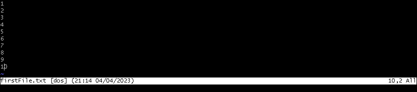
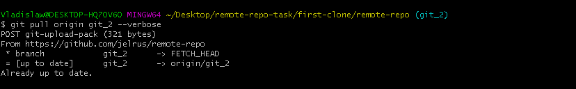
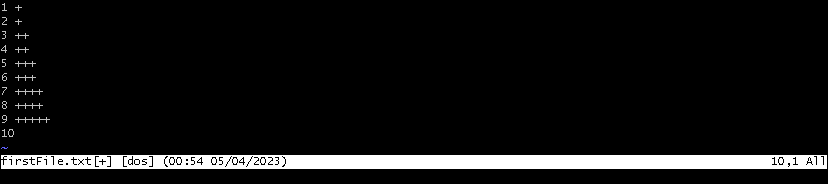
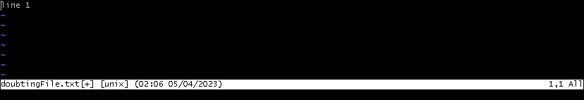

## Remote Repo Task

----------------------------------------------------------------

### Contents

1. Task
2. Used commands
3. Solution  
3.1. Preparations   3.2. Part 1   3.3. Part 2

----------------------------------------------------------------

### 1. Task

Practice skills obtained from branching task, master new git commands and manipulations with remote and
local repositories

----------------------------------------------------------------

### 2. Used commands

- Console commands

| Syntax             | Description                                                                     |
|--------------------|---------------------------------------------------------------------------------|
| `mkdir <dirname>`  | creates new directory in current directory with `<dirname>` if not exist        |
| `mkdir -p <path>`  | creates new directories in current directory according to `<path>` if not exist |
| `cd <path>`        | changes current working directory to directory with `<path>`                    |
| `touch <filename>` | creates empty file with `<filename>`                                            |

- Git commands

| Syntax                                                                              | Description                                                                                                      |
|-------------------------------------------------------------------------------------|------------------------------------------------------------------------------------------------------------------|
| `git clone <path>`                                                                  | clones project according to specified `<path>` or link                                                           |
| `vim <filename>`                                                                    | opens file with `<filename>` in vim editor                                                                       |
| `git add <filename>`                                                                | stages file with `<filename>`                                                                                    |
| `git commit -m "<message>"`                                                         | creates commit with specified `<message>`                                                                        |
| `git log --all --oneline`                                                           | shows logs                                                                                                       |
| `git branch -m <branch> <name>`                                                     | renames `<branch>` with specified `<name>`                                                                       |
| `git checkout -b <name>`                                                            | creates branch with specified `<name>` and switches to it                                                        |
| `git checkout <name>`                                                               | switches to branch with specified `<name>`                                                                       |
| `git push --all -u`                                                                 | pushes all branches to remote repository and add for each successfully pushed branch tracking reference          |
| `git merge <branch> --no-ff`                                                        | merges `<branch>` to current branch, merge conflict resolves manually                                            |
| `git format-patch <n> <hash>`                                                       | creates `<n>` patches from the topmost commit specified by `<hash>`                                              |
| `git apply <patch-name>`                                                            | applies patch  specified by `<patch-name`> to current branch                                                     |
| `git add .`                                                                         | stages all untracked files                                                                                       |
| `git cherry-pick --edit <hash>`                                                     | cherry-picks commit specified by `<hash>` to current branch with edit message option                             |
| `git reset HEAD~<n>`                                                                | resets current HEAD to specified `<n>` commit from the topmost                                                   |
| `git commit --amend --no-edit --author "<author>"   --date=<date> -m "<message"` | replaces the tip of the current branch by creating a new commit with specified `<author>`, `<date>`, `<message>` |
| `git revert HEAD~n`                                                                 | reverts the changes specified by the `<n>` commit in HEAD, creates a new commit with the reverted changes        |
| `git reset --hard HEAD~n`                                                           | resets current HEAD and working tree to specified `<n>` commit from the topmost                                  |
| `git fetch`                                                                         | downloads objects and refs from another repository                                                               |
| `git merge <remote>/<branch>`                                                       | merges current local branch with `<remote>` `<branch>`                                                           |
| `git push`                                                                          | updates remote refs along with associated objects                                                                |
| `git pull`                                                                          | downloads objects and refs from another repository and merges current local branch with `<remote>` `<branch>`    |
| `git stash`                                                                         | saves current local repo state                                                                                   |
| `git stash pop`                                                                     | returns to local state from the topmost stash                                                                    |
| `git stash list`                                                                    | shows list of stashes                                                                                            |
| `git stash pop@{<id>}`                                                              | returns to local state specified by stash with `<id>`                                                            |
| `git rebase -i HEAD~<n>`                                                            | launches interactive rebase for `<n>` topmost from HEAD commits                                                  |
| `git reflog`                                                                        | shows reference logs                                                                                             |

----------------------------------------------------------------

### 3. Solution

----------------------------------------------------------------

###3.1. Preparations

    First create a new remote repository. Clone it. Create new file named README.md with any text 
    and commit it with "initial commit" message.

    When you have first commit, you're able to create branches. To start this task, you need to create 3 branches:

    1. Start from master. From master create branch named git_task and checkout it.
    2. From git_task you should create two branches: git_1 and git_2.

    Push every branch to the remote (see git push --all -u and read about upstream and tracked branches). At the end 
    you should have 4 branches and README.md file both in your local and remote repositories:

    master, git_task, git_1 and git_2

1. Create repository on gitHub which will be the remote one

2. Copy clone link. In this example it is `https://github.com/jelrus/remote-repo.git`

3. Create folder for project clone on disk with `mkdir -p remote-repo-task/first-clone`

4. Change current directory to newly created with `cd remote-repo-task/first-clone`

5. Clone project with `git clone https://github.com/jelrus/remote-repo.git`

6. Change current directory to cloned project directory with `cd remote-repo` 

7. Create file README.md with `touch README.md`

8. Open file README.md with `vim README.md`

9. In opened window press `i` to enter edit mode.   
   Add text e.g. `This is readme for this task` to the `README.md` on the first line.   
   Press `ESC` to leave edit mode. Press `SHIFT + ZZ` to save changes and close window.

 <b>Before editing</b>

 <b>After editing</b>

10. Stage file README.md with `git add README.md`

11. Commit changes for file README.md with `git commit -m "initial commit"`

12. Check log for changes with `git log --all --oneline`

<b>Optional. Rename main branch to master with `git branch -m main master`</b>

13. Create branch `git_task` with `git checkout -b git_task`

14. Create branch `git_1` from branch `git_task` with `git checkout -b git_1`

15. Switch to branch `git_task` with `git checkout git_task`

16. Create branch `git_2` from branch `git_task` with `git checkout -b git_2`

17. Check if all branches was created with `git show-branch`

18. Push branches to remote repo with `git push --all -u`

19. Check branches on the remote repo

------------------------------------------------------------------

###3.2. Part 1

------------------------------------------------------------------

    Now proceed these steps:

    Step 1. git_1: Add and commit firstFile.txt file with 10 lines.

1. Switch to branch `git_1` with `git checkout git_1`

2. Create file `firstFile.txt` with `touch firstFile.txt`

3. Open file `firstFile.txt` with `vim firstFile.txt`

4. In opened window press `i` to enter edit mode.  
   Add `10 lines` to `firstFile.txt`.   
   Press `ESC` to leave edit mode. Press `SHIFT + ZZ` to save changes and close window.

 <b>Before editing</b>

 <b>After editing</b>

5. Stage file `firstFile.txt` with `git add firstFile.txt`

6. Commit changes on file `firstFile.txt` with `git commit -m "[first-clone/git_1](firstFile.txt) created and 10 lines added"`

7. Check log for changes with `git log --all --oneline`

----------------------------------------------------------------------------------------------------

    Step 2. git_1: Add and commit secondFile.txt file with 10 lines.

1. Create file `secondFile.txt` with `touch secondFile.txt`

2. Open file `secondFile.txt` with `vim secondFile.txt`

3. In opened window press `i` to enter edit mode.  
   Add `10 lines` to `secondFile.txt`.  
   Press `ESC` to leave edit mode. Press `SHIFT + ZZ` to save changes and close window.

 <b>Before editing</b>

 <b>After editing</b>

4. Stage file `secondFile.txt` with `git add secondFile.txt`

5. Commit changes on file `secondFile.txt` with `git commit -m "[first-clone/git_1](secondFile.txt) created and 10 lines added`

6. Check log for changes `git log --all --oneline`

-----------------------------------------------------------------------------------------------------

      Step 3. `merge` branch git_1 to git_2

1. Switch to branch `git_2` with `git checkout git_2`

2. Merge branch `git_1` to branch `git_2` with `git merge git_1 --no-ff`

3. Edit commit message in opened file `MERGE_MSG.txt`.  
   Change first line with desirable message e.g. `[first-clone/git_2]|MERGE| branch [git_1] to branch [git_2]`  
   Save and exit.

 <b>Before editing</b>

 <b>After editing</b>

4. Check log for changes with `git log --all --oneline`

-----------------------------------------------------------------------------------------------------

      Step 4. git_2: Update and commit any two lines in secondFile.txt.

1. Open file `secondFile.txt` with `vim secondFile.txt`

2. In opened window press `i` to enter edit mode.  
   Edit `2 lines` in `secondFile.txt`.  
   Press `ESC` to leave edit mode. Press `SHIFT + ZZ` to save changes and close window.

 <b>Before editing</b>

 <b>After editing</b>

3. Stage file `secondFile.txt` with `git add secondFile.txt`

4. Commit changes on file `secondFile.txt` with `git commit -m "[first-clone/git_2](secondFile.txt) 2 lines edited"`

5. Check log for changes with `git log --all --oneline`

-----------------------------------------------------------------------------------------------------

      Step 5. git_1: Update and commit the same 2 lines with the different info in secondFile.txt

1. Switch to branch `git_1` with `git checkout git_1`

2. Open file `secondFile.txt` with `vim secondFile.txt`

3. In opened window press `i` to enter edit mode.  
   Edit `another 2 lines` in `secondFile.txt`.  
   Press `ESC` to leave edit mode. Press `SHIFT + ZZ` to save changes and close window.

 <b>Before editing</b>

 <b>After editing</b>

4. Stage file `secondFile.txt` with `git add secondFile.txt`

5. Commit changes on file `secondFile.txt` with `git commit -m "[first-clone/git_1](secondFile.txt) 2 lines edited"`

6. Check log for changes with `git log --all --oneline`

-----------------------------------------------------------------------------------------------------

      Step 6. merge branch git_2 to git_1, resolve conflict. Left all (4) modified lines. Commit.

1. Merge branch `git_2` to branch `git_1` with `git merge git_2 --no-ff`

2. Open file `secondFile.txt` with `vim secondFile.txt`

3. In opened window press `i` to enter edit mode.  
   Remove `<<<<<<< HEAD` at line 1, `=======` at line 4,  `>>>>>>> git_2` at line 7.  
   Press `ESC` to leave edit mode. Press `SHIFT + ZZ` to save changes and close window.

 <b>Before editing</b>

 <b>After editing</b>

4. Stage file `secondFile.txt` with `git add secondFile.txt`

5. Commit merging with `git commit -m "[first-clone/git_1]|MERGE| branch [git_2] to branch [git_1]"`

6. Check log for changes with `git log --all --oneline`

-----------------------------------------------------------------------------------------------------

      Step 7. git_1: Update and commit firstFile.txt file, modify two lines.

1. Open file `firstFile.txt` with `vim firstFile.txt`

2. In opened window press `i` to enter edit mode.  
   Edit `2 lines` in `firstFile.txt`.  
   Press `ESC` to leave edit mode. Press `SHIFT + ZZ` to save changes and close window.

 <b>Before editing</b>

 <b>After editing</b>

3. Stage file `firstFile.txt` with `git add firstFile.txt`

4. Commit changes on file `firstFile.txt` with `git commit -m "[first-clone/git_1](firstFile.txt) 2 lines edited"`

5. Check log for changes with `git log --all --oneline`

-----------------------------------------------------------------------------------------------------

      Step 8. git_1: Update and commit firstFile.txt file, modify another two lines.

1. Open file `firstFile.txt` with `vim firstFile.txt`

2. In opened window press `i` to enter edit mode.  
   Edit `another 2 lines` in `firstFile.txt`.  
   Press `ESC` to leave edit mode. Press `SHIFT + ZZ` to save changes and close window.

 <b>Before editing</b>

 <b>After editing</b>

3. Stage file `firstFile.txt` with `git add firstFile.txt`

4. Commit changes on file `firstFile.txt` with `git commit -m "[first-clone/git_1](firstFile.txt) another 2 lines edited"`

5. Check log for changes with `git log --all --oneline`

-----------------------------------------------------------------------------------------------------

      Step 9. Transfer changes of commit from Step 7 only to git_2, using format patch.

1. Open log with `git log --all --oneline`

2. Find and copy hash of commit for patch, here `ba50b23`

3. Create patch file of commit with `git format-patch -1 ba50b23`

4. Copy patch filename from console, here `0001-first-clone-git_1-firstFile.txt-2-lines-edited.patch`

5. Switch to branch `git_2` with `git checkout git_2`

6. Apply patch with `git apply --verbose 0001-first-clone-git_1-firstFile.txt-2-lines-edited.patch`

7. Stage changed files with `git add .`

8. Commit changes on files with `git commit -m "[first-clone/git_1](firstFile.txt) patch applied"`

9. Check log for changes with `git log --all --oneline`

-----------------------------------------------------------------------------------------------------

      Step 10. Transfer changes of commit from Step 8 only to git_2, using cherrypick command.

1. Open log with `git log --all --oneline`

2. Find and copy hash of commit, here `caac0ee`

3. Cherry-pick commit with `git cherry-pick --edit caac0ee`

4. Edit commit message in opened file `COMMIT_EDITMSG.txt`.  
   Change first line with desirable message e.g. `[first-clone/git_2](firstFile.txt) commit was cherry-picked from git1`  
   Save and exit.

 <b>Before editing</b>

 <b>After editing</b>

5. Check log for changes with `git log --all --oneline`

-----------------------------------------------------------------------------------------------------

      Step 11. git_2: Concatenate the last two commits using reset + commit commands.

1. Undo changes of the last two commits (`351e35c` and `19c3e95`) with `git reset HEAD~2`

2. Check log for changes with `git log --all --oneline`

3. Stage changed files with `git add .`

4. Commit changes on files with `git commit -m "[first-clone/git_2] concat of the last two commits"`

5. Check log for changes with `git log --all --oneline`

-----------------------------------------------------------------------------------------------------

      Step 12. git_2: Change date, author and message of the last commit and add non-empty thirdFile.txt file to it.

1. Create file `thirdFile.txt` with `touch thirdFile.txt`

2. Open file `thirdFile.txt` with `vim thirdFile.txt`

3. In opened window press `i` to enter edit mode.  
   Add text e.g. `This is the third file` in `thirdFile.txt`.  
   Press `ESC` to leave edit mode. Press `SHIFT + ZZ` to save changes and close window.

 <b>Before editing</b>

 <b>After editing</b>

4. Stage file `thirdFile.txt` with `git add thirdFile.txt`

5. Commit changes on file thirdFile with `git commit --amend --no-edit --author "Bob <bob@gmail.com>" --date=now -m
"[first-clone/git_2](thirdFile.txt) author, date, message changed; file added`

6. Check log for changes with `git log --all`

-----------------------------------------------------------------------------------------------------

      Step 13. git_2: Create a new commit that reverts changes of the last one.

1. Revert the last commit with `git revert HEAD~1`

2. Edit commit message in opened file `COMMIT_EDITMSG.txt`.  
   Change first line with desirable message e.g. `This is revert of commit e249c53`.  
   Save and exit.

 <b>Before editing</b>

 <b>After editing</b>

3. Check log for changes with `git log --all --oneline`

-----------------------------------------------------------------------------------------------------

      Step 14. git_2: Create and commit thirdFile.txt file.

1. Create file `thirdFile.txt` with `touch thirdFile.txt`

2. Stage file `thirdFile.txt` with `git add thirdFile.txt`

3. Commit changes on file `thirdFile.txt` with `git commit -m "[first-clone/git_2](thirdFile.txt) file created"`

4. Check log for changes with `git log --all --oneline`

-----------------------------------------------------------------------------------------------------

      Step 15. git_2: Run command that removes all changes of the last two commits.

1. Remove all changes of the last two commits with `git reset --hard HEAD~2`

2. Check log for changes with `git log --all --oneline`

-----------------------------------------------------------------------------------------------------

      Step 16. Synchronize git_1 and git_2 with a remote repository.

1. Switch to branch `git_1` with `git checkout git_1`

2. Pull from remote with `git pull --verbose`

      NOTE! `git push` command in context of this task is combination of:
      `git fetch` - download objects and refs from remote repository
      `git merge` - join development histories of local and remote repositories together
      So combination `git fetch` && `git merge` can be used instead of `git pull`

<b>Let's pull with combination of `git fetch` && `git merge`:</b>

a. Download objects and refs from remote repository with `git fetch --verbose`

b. Join development histories for branch `git_1` of local and remote repos together with `git merge origin/git_1`

3. Push changes to remote with `git push`

4. Switch to branch `git_1` with `git checkout git_2`

5. Pull from remote with `git pull --verbose`

6. Push changes to remote with `git push`

-----------------------------------------------------------------------------------------------------

      Step 17. clone your project to another folder.

1. Change current directory to `root directory` with `cd ../../`

2. Create new directory with `mkdir second-clone`

3. Change current directory to `second-clone` with `cd second-clone/`

4. Copy clone link from gitHub repository `https://github.com/jelrus/remote-repo.git`

5. Clone project with `git clone https://github.com/jelrus/remote-repo.git`

6. Change current directory to `remote-repo` with `cd remote-repo/`

-----------------------------------------------------------------------------------------------------

      Step 18. folder2: git_1: Change two lines in firstFile.txt. commit + push.

1. Switch to branch `git_1` with `git checkout git_1`

2. Open file `firstFile.txt` with `vim firstFile.txt`

3. In opened window press `i` to enter edit mode.  
   Edit `2 lines` in `firstFile.txt`.  
   Press `ESC` to leave edit mode. Press `SHIFT + ZZ` to save changes and close window.

 <b>Before editing</b>

 <b>After editing</b>

4. Stage file `firstFile.txt` with `git add firstFile.txt`

5. Commit changes on `firstFile.txt` with `git commit -m "[second-clone/git_1](firstFile.txt) 2 lines edited"`

6. Push changes to remote with `git push`

-----------------------------------------------------------------------------------------------------

      Step 19. folder1: git_1: Change another two lines in firstFile.txt.

1. Change current directory to the `first-clone/remote-repo/` with `cd ../../first-clone/remote-repo`

2. Switch to branch `git_1` with `git checkout git_1`

3. Open file `firstFile.txt` with `vim firstFile.txt`

4. In opened window press `i` to enter edit mode.  
   Edit `another 2 lines` in `firstFile.txt`.  
   Press `ESC` to leave edit mode. Press `SHIFT + ZZ` to save changes and close window.

 <b>Before editing</b>

 <b>After editing</b>

5. Save local changes with `git stash`

-----------------------------------------------------------------------------------------------------

      Step 20. folder1: git_1:
               - Change another line in firstFile.txt (not the same as in 18, 19).

1. Open file `firstFile.txt` with `vim firstFile.txt`

2. In opened window press `i` to enter edit mode.  
   Edit `another 1 line` in `firstFile.txt`.  
   Press `ESC` to leave edit mode. Press `SHIFT + ZZ` to save changes and close window.

 <b>Before editing</b>

 <b>After editing</b>

3. Stage file `firstFile.txt`

4. Commit file `firstFile.txt` with `git commit -m "[folder1/git_1](firstFile.txt) line 9 edited"`

               - merge changes from Step 18 (pull) without committing changes from Step 19 and any additional commits.

1. Pull from remote with `git pull origin git_1 --verbose`

2. Edit commit message in opened file `MERGE.msg`.  
   Change first line with desirable message e.g. `[first-clone/git_1]|MERGE| branch git 1 remote to git 1 local`.  
   Save and exit.

 <b>Before editing</b>

 <b>After editing</b>

3. Check merging result in file `firstFile.txt` with `vim firstFile.txt`

4. Check if changes applied properly.
   Press `ESC` to leave edit mode. Press `SHIFT + ZZ` to save changes and close window.

5. Check log for changes 

    with `git log --all --oneline`

    

    with `git log --graph --oneline --all`

    

      - push without commit changes.

1. Push changes to remote with `git push`

2. Check if file firstFile.txt in branch git_1 changed properly

        - Return to local state of Step 19. (stash)

1. Local state can be restored  

    a. With `git stash pop` if you want to retrieve last stashed local state  

    

    b. If you want to retrieve specific stashed local state  

      Get stash list with `git stash list`  

        
       
      Copy id of stash, here id `stash@{0}`   

         
       
      Retrieve specific local state with `git stash pop stash@{0}`  

        
       
2. Resolve conflicts by keeping last push changes, stashed or merged changes.  
    Let's merge changes - keep both last push changes and stashed altogether.  

    Open file firstFile.txt with `git firstFile.txt`   

      

    In opened window press `i` to enter edit mode.  
    Remove `<<<<<<< HEAD`, `=======`,  `>>>>>>> git_1`.  
    Edit file `firstFile.txt` so it looks like changes were applied consequently.  
    Press `ESC` to leave edit mode. Press `SHIFT + ZZ` to save changes and close window.   

     <b>Before editing</b>  

     <b>After editing</b>  

    Stage file `firstFile.txt` with `git add firstFile.txt`  

      

    Commit changes on `firstFile.txt` with `git commit -m "[first-clone/git_1]|MERGE|(firstFile.txt) was merged with stashed file"`  

    

-----------------------------------------------------------------------------------------------------

###3.3. Part 2

------------------------------------------------------------------

     Step 1. Create git_3 branch from git_task. Checkout to git_3.

1. Switch to branch `git_task` with `git checkout git_task`

2. Create new branch `git_3` with `git checkout -b git_3`

---------------------------------------------------------------------------------------------

      Step 2. Add new empty file doubtingFile.txt and commit it.

1. Create new empty file `doubtingFile.txt` with `touch doubtingFile.txt`

2. Stage file `doubtingFile.txt` with `git add doubtingFile.txt`

3. Commit file `doubtingFile.txt` with `git commit -m "[first-clone/git_3](doubtingFile.txt) created"`

4. Check log for changes `with git log --all --oneline`

----------------------------------------------------------------------------------------------

      Step 3. Add a line to a file and commit changes. Do it 5 times. 
              You should end up with 5 lines in a file and 6 commits: 
              1 for creating an empty file and 5 for adding a line. 

1. Commit on the first line in file `doubtingFile.txt`

   Open file `doubtingFile.txt` with `vim doubtingFile.txt`

   In opened window press `i` to enter edit mode.  
   Add `line 1` in `doubtingFile.txt`.  
   Press `ESC` to leave edit mode. Press `SHIFT + ZZ` to save changes and close window.

 <b>Before editing</b>

 <b>After editing</b>

   Stage file `doubtingFile.txt` with `git add doubtingFile.txt`

   Commit changes on file `doubtingFile.txt` with `git commit -m "[first-clone/git_3](doubtingFile.txt) line 1 added"`

2. Commit on the second line in file `doubtingFile.txt`

   Open file `doubtingFile.txt` with `vim doubtingFile.txt`

In opened window press `i` to enter edit mode.  
Add `line 2` in `doubtingFile.txt`.  
Press `ESC` to leave edit mode. Press `SHIFT + ZZ` to save changes and close window.

 <b>Before editing</b>

 <b>After editing</b>

Stage file `doubtingFile.txt` with `git add doubtingFile.txt`

Commit changes on file `doubtingFile.txt` with `git commit -m "[first-clone/git_3](doubtingFile.txt) line 2 added"`

3. Commit on the third line in file `doubtingFile.txt`

   Open file `doubtingFile.txt` with `vim doubtingFile.txt`

In opened window press `i` to enter edit mode.  
Add `line 3` in `doubtingFile.txt`.  
Press `ESC` to leave edit mode. Press `SHIFT + ZZ` to save changes and close window.

 <b>Before editing</b>

 <b>After editing</b>

Stage file `doubtingFile.txt` with `git add doubtingFile.txt`

Commit changes on file `doubtingFile.txt` with `git commit -m "[first-clone/git_3](doubtingFile.txt) line 3 added"`

4. Commit on the fourth line in file `doubtingFile.txt`

Open file `doubtingFile.txt` with `vim doubtingFile.txt`

In opened window press `i` to enter edit mode.  
Add `line 4` in `doubtingFile.txt`.  
Press `ESC` to leave edit mode. Press `SHIFT + ZZ` to save changes and close window.

 <b>Before editing</b>

 <b>After editing</b>

Stage file `doubtingFile.txt` with `git add doubtingFile.txt`

Commit changes on file `doubtingFile.txt` with `git commit -m "[first-clone/git_3](doubtingFile.txt) line 4 added"`

5. Commit on the fifth line in file `doubtingFile.txt`

Open file `doubtingFile.txt` with `vim doubtingFile.txt`

In opened window press `i` to enter edit mode.  
Add `line 5` in `doubtingFile.txt`.  
Press `ESC` to leave edit mode. Press `SHIFT + ZZ` to save changes and close window.

 <b>Before editing</b>

 <b>After editing</b>

Stage file `doubtingFile.txt` with `git add doubtingFile.txt`

Commit changes on file `doubtingFile.txt` with `git commit -m "[first-clone/git_3](doubtingFile.txt) line 5 added"`

-----------------------------------------------------------------------------------------------

      Step 4. Check you log and copy it somewhere.

1. Check log for changes with `git log --all --oneline`

2. Check log for changes with git `log --graph --oneline --all`

3. Copy it somewhere

-----------------------------------------------------------------------------------------------

      Step 5. Launch interactive rebase for 5 last commits, squash all the latest commits into the first one. 
              Reword first commit. You should end up with 2 commits:
              one for creating an empty file and the second for adding 5 lines. 
              Second commit should have a new commit message.

1. Open interactive rebase for `five last commits` with `git rebase -i HEAD~5`

2. Edit operations in opened file `git-rebase-todo.txt`.  
   Reword first commit. Change `pick` to `reword` on `line 1`.  
   Squash other commits. Change `pick` to `squash` on `lines 2, 3, 4, 5` respectively  
   Save and exit.

 <b>Before editing</b>

 <b>After editing</b>

   Edit commit message for the first commit in opened file `COMMIT_EDITMSG.txt`.  
   Save and exit.

 <b>Before editing</b>

 <b>After editing</b>

   Check if first commit edited properly and remove four other in opened file `COMMIT_EDITMSG.txt`.  
   Save and exit.

 <b>Before editing</b>

 <b>After editing</b>

--------------------------------------------------------------------------------------------------

      Step 6. Check your log and compare it with the previous one. 
              Look at the hash, date, commit message. Explain what changed and why.

   Let's compare log from step 4 with log from step 5

 <b>Step 4. Log</b>

   Check log for changes with `git log --all --oneline`

 <b>Step 5. Log</b>

   <u>**So what happened?**</u>
   
   Let's see simplified progress in `git_3` from log obtained in Step 4.

   
   As we can see each commit added independently of each other.  
   HEAD moves from `file creation` to `add the fifth line` commit.  
   Each commit has its own hash, date and message.

   Let's see rebase action simplified.

   As we can see each squashed in commit aggregates changes from squashed one.
   And by the end all the info merges into the aggregated commit which replaces the first one with new hash, date, 
   message or any other info that was picked in the edit stages.

---------------------------------------------------------------------------------------------------------

      Step 7. Check your reflog. Explain to your mentor what you can see and why.

   Check reflog for changes with `git reflog`

   In reflog (reference log) we see that each one from five commits concatenates each one in next to be squashed in 
   commit. Which means that we aggregate changes from one to one squashed commits. As we can in previous log analysis.

---------------------------------------------------------------------------------------------------------