### React

Application server runs on http://localhost:8080

React UI app runs on http://localhost:3030

Database MySQL
URL: jdbc:mysql://localhost:3306/rest_api_security?useSSL=false&serverTimezone=UTC&createDatabaseIfNotExist=true
username: root
password: rootroot1A
________________________________________________________________________________________________________________________
Data for pre population resides in {proj.dir}/src/main/resources/ :
- schema.sql, used for creating schema and tables
- gift-certificates-tags-users-only.sql for populating created tables
________________________________________________________________________________________________________________________
**Admin credentials:**

Login: admin
Password: password

**User credentials:**

**n - user id value**

Login: user_n
Password: password_n
________________________________________________________________________________________________________________________

**NOTE: For better visual quality check videos in {proj.dir}/media/demo folder**

### How to start?

1. Launch REST application
    - Open up IDE
    - Navigate to src/main/java/epam/com/esm/RestApiReactUiApplication
    - Run it
2. Launch React application
   - Open project's folder
   - Run command in cmd
    
          npm start

   - After launching, it will bring you to the main page located at http://localhost:3030

________________________________________________________________________________________________________________________
### Accessible pages
________________________________________________________________________________________________________________________
#### Login page (http://localhost:3030/login)
________________________________________________________________________________________________________________________
**Requirements:**

**Layout**
________________________________________________________________________________________________________________________
1. Navbar fixed to top
2. Footer on bottom
3. Login and password input fields
4. Login button

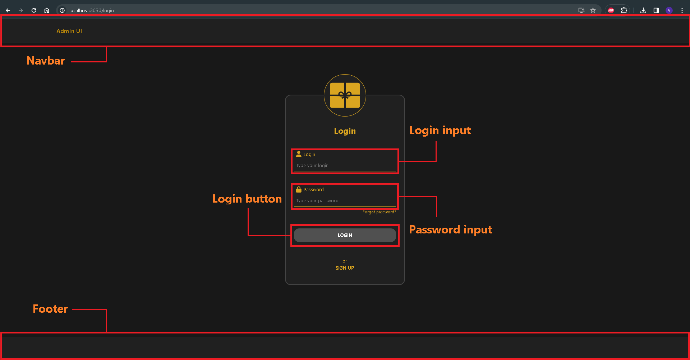
________________________________________________________________________________________________________________________
**Functionality**
________________________________________________________________________________________________________________________
1. On successful login, redirect to "Certificate List page"”"

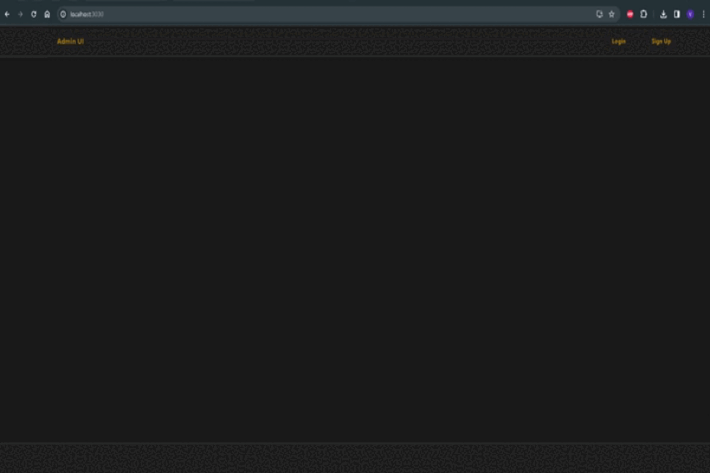

2. Error returned from server area. (such as "Login or Password is not found")
3. Input fields should be validated, and inline error messages should be displayed according to the following rules:
   -  No blank fields 
   -  Login field length must not be less than 3 characters and greater than 30 characters 
   -  Password length must not be less than 4 characters and greater than 30 characters

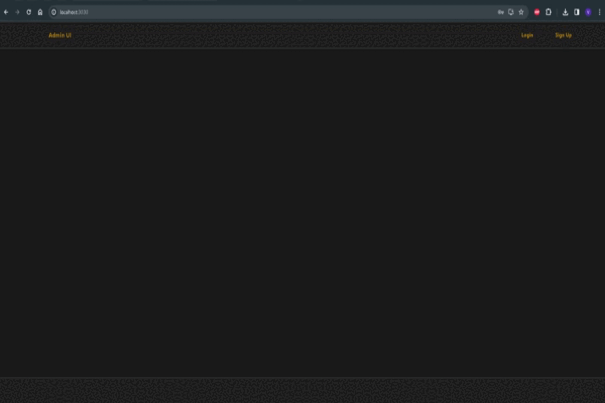
________________________________________________________________________________________________________________________
#### Certificate list page (http://localhost:3030/certificates)
________________________________________________________________________________________________________________________
**Layout**
________________________________________________________________________________________________________________________
1. Navbar fixed to top
2. Footer on bottom
3. Styles of header and footer should be implemented according to the mockups, should be static and be stuck to the top
      and on the bottom of the page.
4. Current user login and picture (picture is optional)

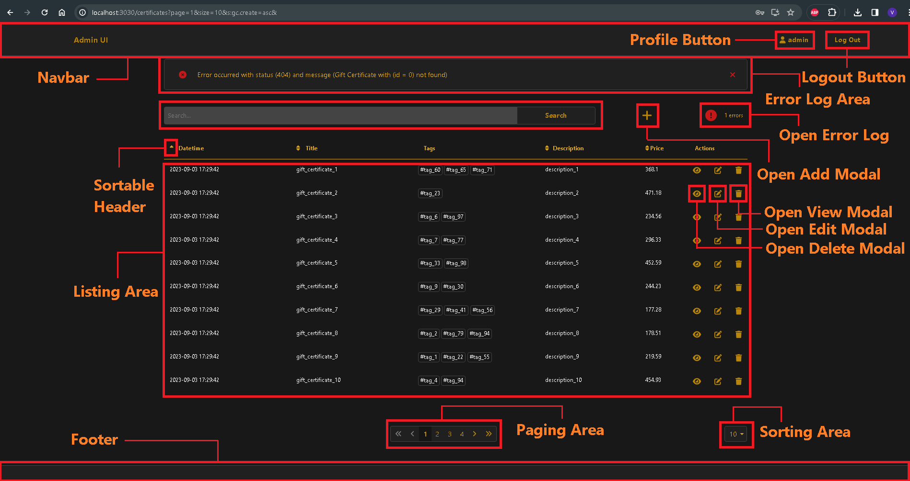
________________________________________________________________________________________________________________________
**Functionality**
________________________________________________________________________________________________________________________
**Pagination**
________________________________________________________________________________________________________________________
**Search**

Search field and action. User can filter data by tags, title, description. For example, fluffy #(little cat) #(fun) -
find certificates that correspond all statements below: * have tags “little cat” and “fun” * contain “fluffy” in title
or description.

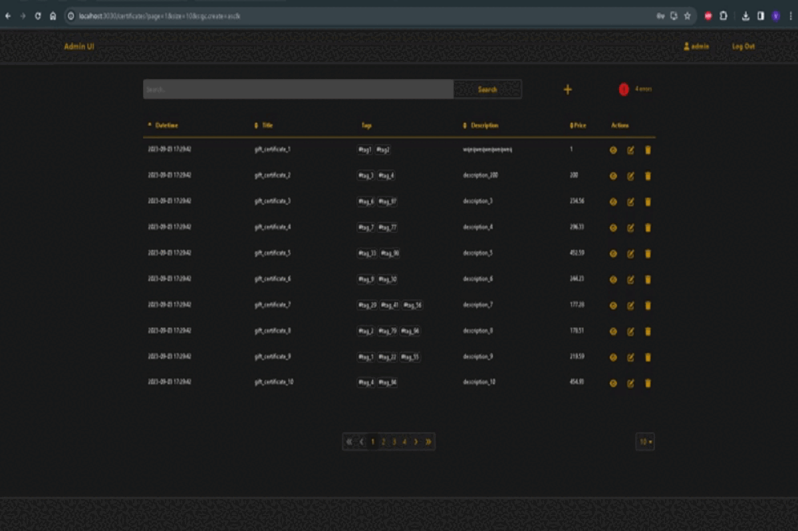
________________________________________________________________________________________________________________________
**Page Size**

Values: 10, 20, 50.

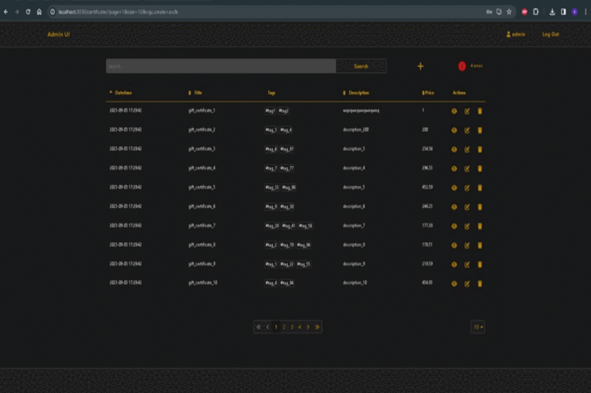
________________________________________________________________________________________________________________________
**Paging**

First and last page should be always accessible. A current page is highlighted.

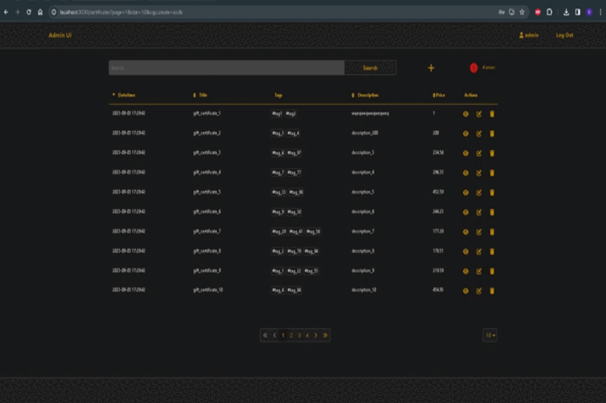
________________________________________________________________________________________________________________________
**Sorting**

By default, data is ordered by creation date. Sort icon show current sort order (asc, desc),
ex: . Clicking on icon trigger sort by corresponding field.

________________________________________________________________________________________________________________________
**Additional Requirements for pagination**

1. Refreshing of a page should not affect pagination.
2. Duplication of browser’s tab should lead to exactly the same page (pagination, etc.).
   Modals may be hidden. Local storage may be used only for security and profile info purposes.
   All search state should be in url.

______________________________________________________________________________________________________________________

**Modal Windows**
________________________________________________________________________________________________________________________
**Modal Add**
________________________________________________________________________________________________________________________
**Layout**

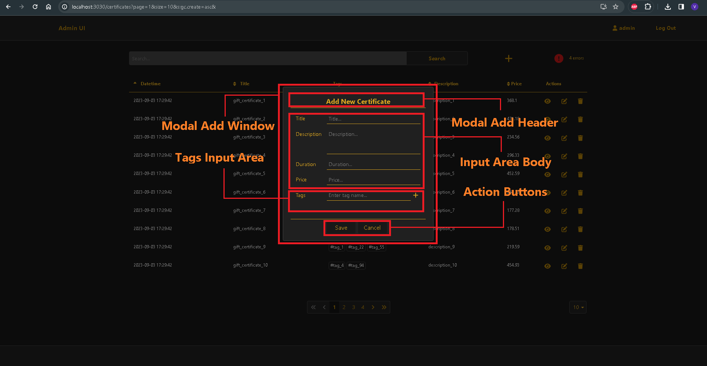
________________________________________________________________________________________________________________________
**Functionality**

1. Open Add Modal
2. Title is Add New Certificate
3. Title, description and price fields are required and should be validated according to the following rules:
    - No blank fields
    - Title field must not be less than 6 and greater than 30 characters
    - Description field must not be less than 12 and greater than 1000 characters
    - Price must be a number or float and be greater than 0 Duration must be a number. 0 – indicates this is an
      infinite certificate Otherwise, if one of the conditions is not met, inline validation error shown in component.
      'Tag' field is optional, but tag name should be not less than 3 and greater than 15 characters.
      After submit, modal must be hidden and data in table reloaded
    - In case of error show inline error shown under modal header

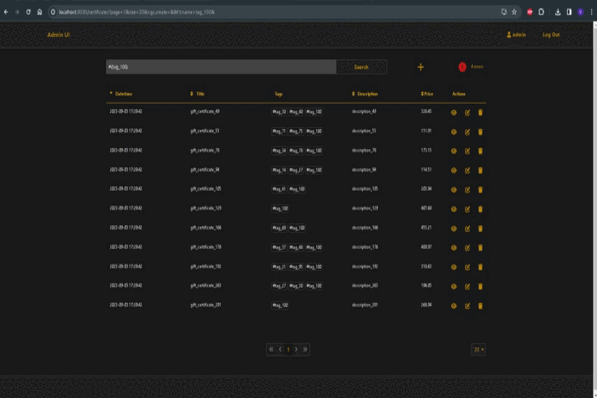
________________________________________________________________________________________________________________________
**Modal View**
________________________________________________________________________________________________________________________
**Layout**

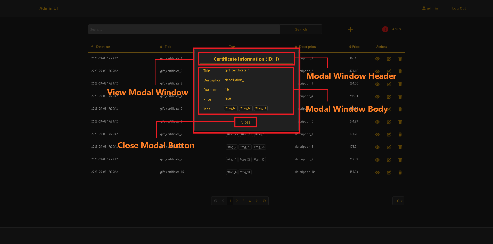

**Functionality**

________________________________________________________________________________________________________________________
**Modal Edit**
________________________________________________________________________________________________________________________
**Layout**

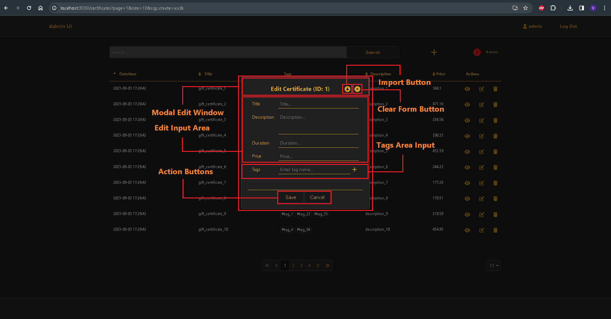
________________________________________________________________________________________________________________________
**Functionality**

1. Open Edit Modal
2. Title is "Edit certificate with ID = ". Data must be pre-populated.
3. Title, description and price fields are required and should be validated according to the following rules:
    - No blank fields
    - Title field must not be less than 6 and greater than 30 characters
    - Description field must not be less than 12 and greater than 1000 characters
    - Price must be a number or float and be greater than 0 Duration must be a number. 0 – indicates this is an
      infinite certificate Otherwise, if one of the conditions is not met, inline validation error shown in component.
      'Tag' field is optional, but tag name should be not less than 3 and greater than 15 characters.
      After submit, modal must be hidden and data in table reloaded.
    - In case of error show inline error shown under modal header

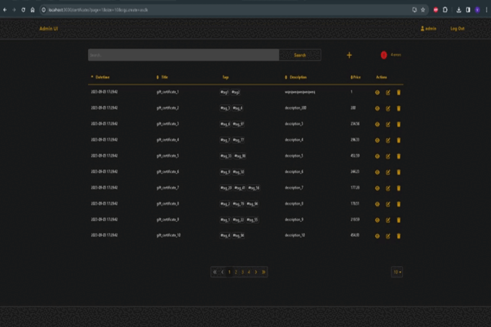
________________________________________________________________________________________________________________________
**Modal Delete**
________________________________________________________________________________________________________________________
**Layout**

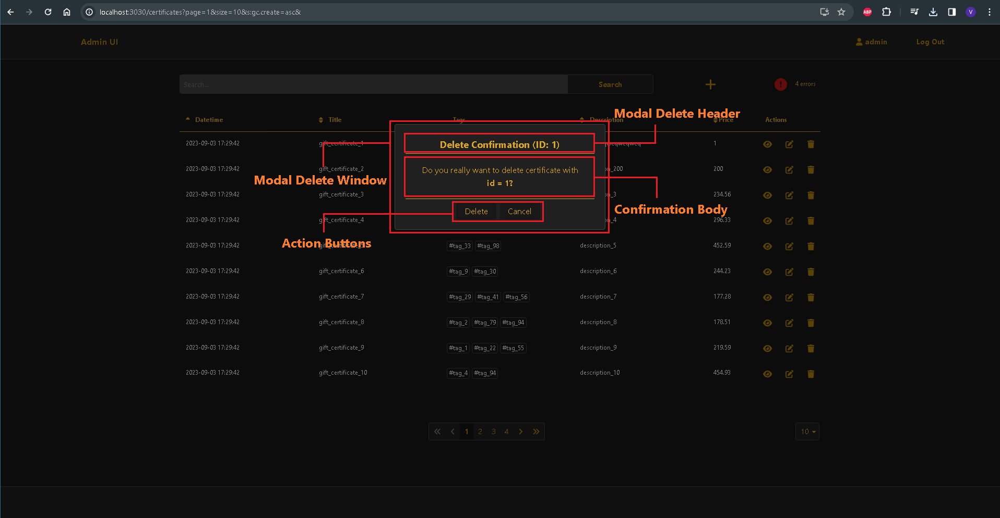
________________________________________________________________________________________________________________________
**Functionality**

Modal confirmation. If user click ‘Yes’, certificate must be deleted, modal hidden and data in table reloaded.

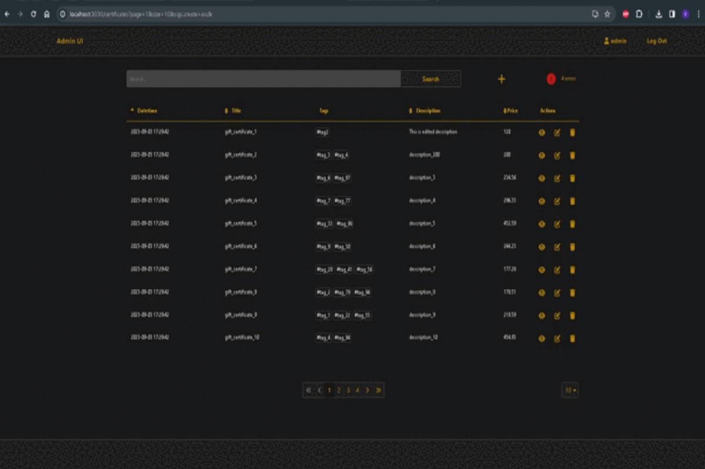
________________________________________________________________________________________________________________________
**Error Log**
________________________________________________________________________________________________________________________
**Layout**

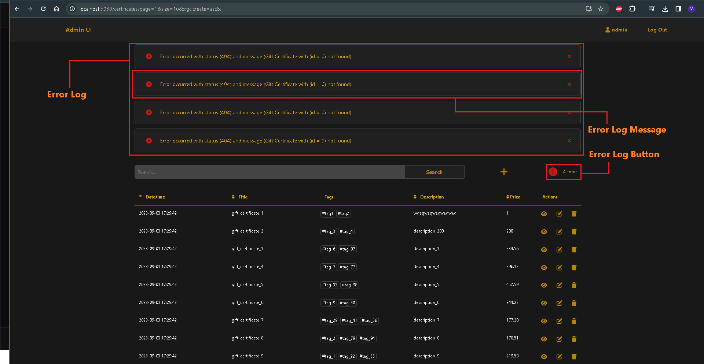
________________________________________________________________________________________________________________________
**Functionality**

Error message in case server returned error. Closeable.

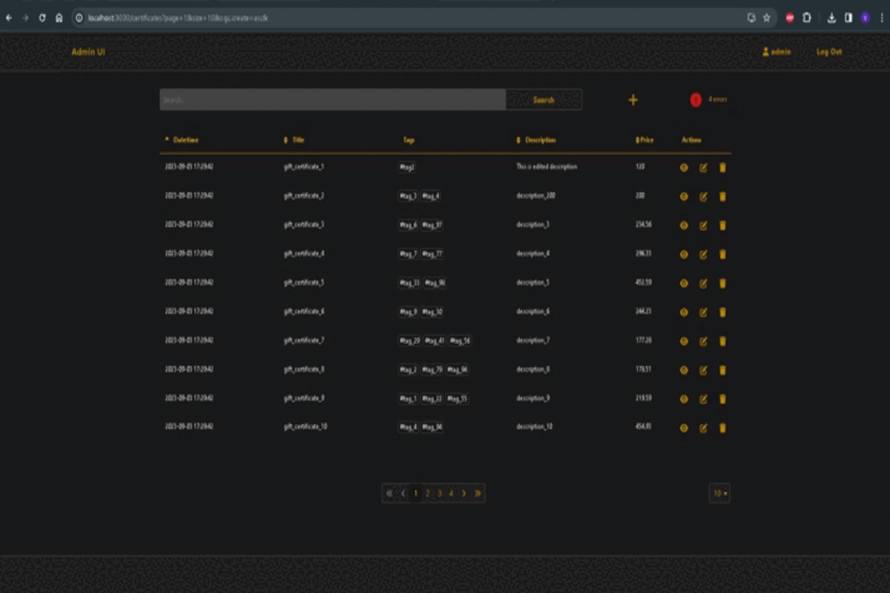
________________________________________________________________________________________________________________________
**Logout**

Go to "Login page" after successful logout

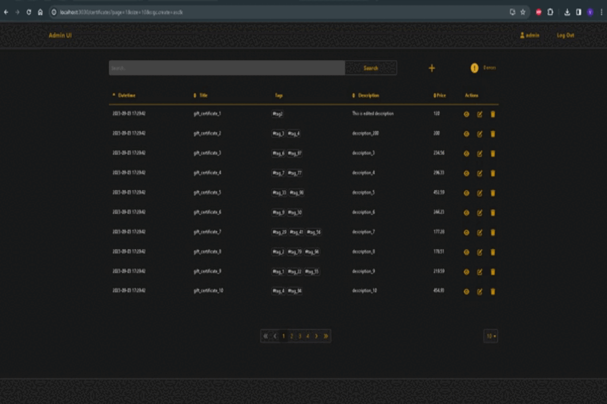
________________________________________________________________________________________________________________________