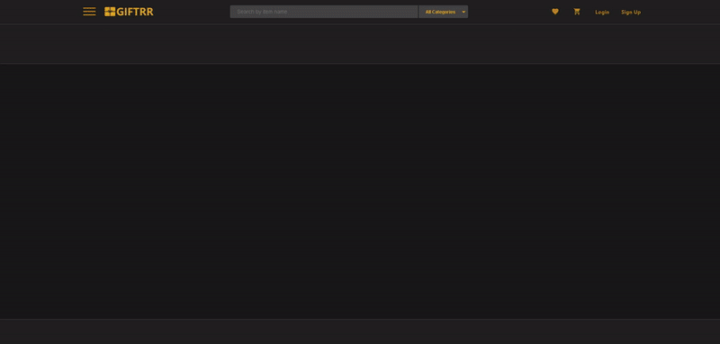
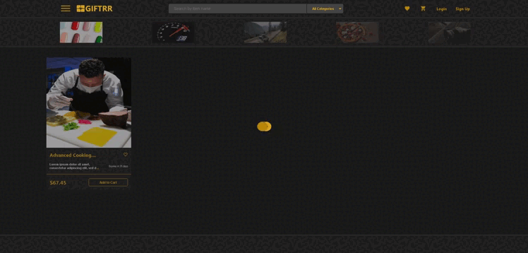

### Completed JS task samples:

#### 1. Infinite items (certificates) scroll

#### 2. Search by name, description and tags

#### 3. Scroll back to top button

#### 4. Feature to return to the last scroll position on the page

#### A. Auto scrolling on reloading page

#### B. Button scrolling to the last saved position

All data is saved in local storage (categories/certificates/pagination state/scroll position)

If new item created it will be placed on the top and items will be sorted (item will be pushed into array via .push()
method and then array will be sorted)

DOM manipulated on native JS

_.debounce method used for search input

_.throttle method used for infinite scroll

**For starting project launch terminal in project folder via:**

> npm start

**Application runs on localhost:8080**